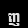

# Khmer Character Recognition 


This repository contains a Python script that generates images with Khmer script labels, such as digits and characters, using random khmer fonts and rotations. These images are saved as PNG files for use in training Khmer character recognition models. Additionally, the images are processed and stored in CSV format for machine learning purposes.

## Features

- **Random Label Generation**: The script generates images of random Khmer digits and characters from a predefined list.
- **Random Font Selection**: The script selects a random font from a ZIP archive containing `.ttf` font files.
- **Random Rotation**: The text in each image is randomly rotated by an angle between -10 and 10 degrees to create variety.
- **Unique Image Filenames**: Each generated image is saved with a unique filename based on the label, font, and rotation angle to avoid overwriting.
- **Output Directory**: All generated images are stored in the `labels/` directory.
- **CSV Conversion**: The images are flattened and saved as a CSV file, where each row contains the label followed by 784 pixel values (for 28x28 images).


Here are some generated images of Khmer characters:




      


## Requirements

- Python 3.x
- `Pillow` (for image creation and manipulation)
- `numpy` (for array operations)
- `pandas` (for CSV manipulation)
- `os`, `csv`, `random`, `io` (standard Python libraries)

You can install the necessary libraries using the following command:

```bash
pip install pillow numpy pandas imbalanced-learn scikit-learn
