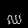

#  Khmer Character Recognition

[](LICENSE)
[](https://www.python.org/)
[](https://pillow.readthedocs.io/en/stable/)
[](https://numpy.org/doc/stable/)
[](https://pandas.pydata.org/)
[](https://scikit-learn.org/stable/)
[](https://imbalanced-learn.org/stable/)

A Python-based dataset generator and image processor for Khmer character recognition tasks. This tool creates PNG images of Khmer script (characters and digits), applies font and rotation augmentations, and exports the dataset into CSV format for model training.

---

## ✨ Features

- 🔡 **Random Label Generation**: Create diverse Khmer digits and characters from a predefined list.
- 🎨 **Random Font Selection**: Randomly choose fonts from a `.zip` archive of Khmer `.ttf` fonts.
- 🔄 **Rotation Augmentation**: Add random rotation (-10° to 10°) to simulate real handwriting variance.
- 🖼️ **Unique Image Naming**: Combines label, font, and rotation angle to prevent overwriting.
- 📁 **Image Output Directory**: Saves images to the `labels/` directory.
- 📊 **CSV Export**: Converts 28×28 images to flattened pixel arrays for model training (`label, pixel1, ..., pixel784`).

---

## 🖼️  Outputs

Here are some sample generated images of Khmer characters:

| Character | Image |
|-----------|-------|
| ញ        |  |
| ក        |  |
| គ        |  |
| ឈ        |  |

---

## 🛠️ Requirements

Install all dependencies using `pip`:

```bash
pip install pillow numpy pandas scikit-learn imbalanced-learn
